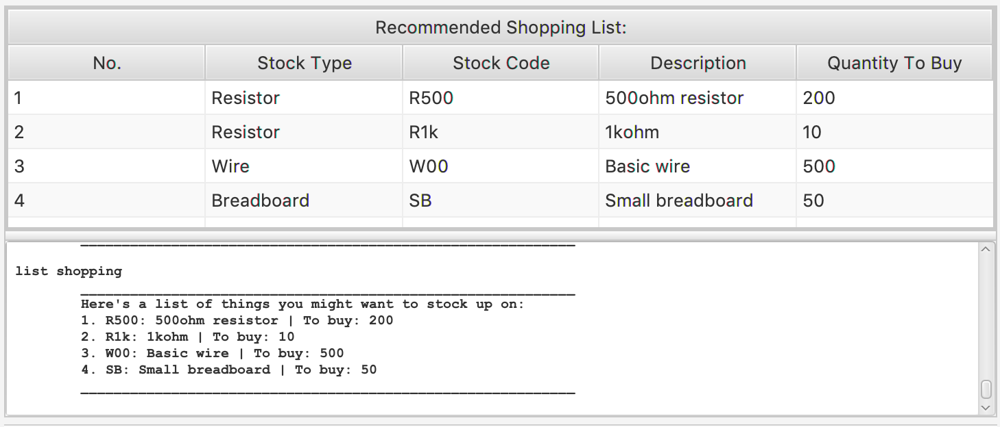
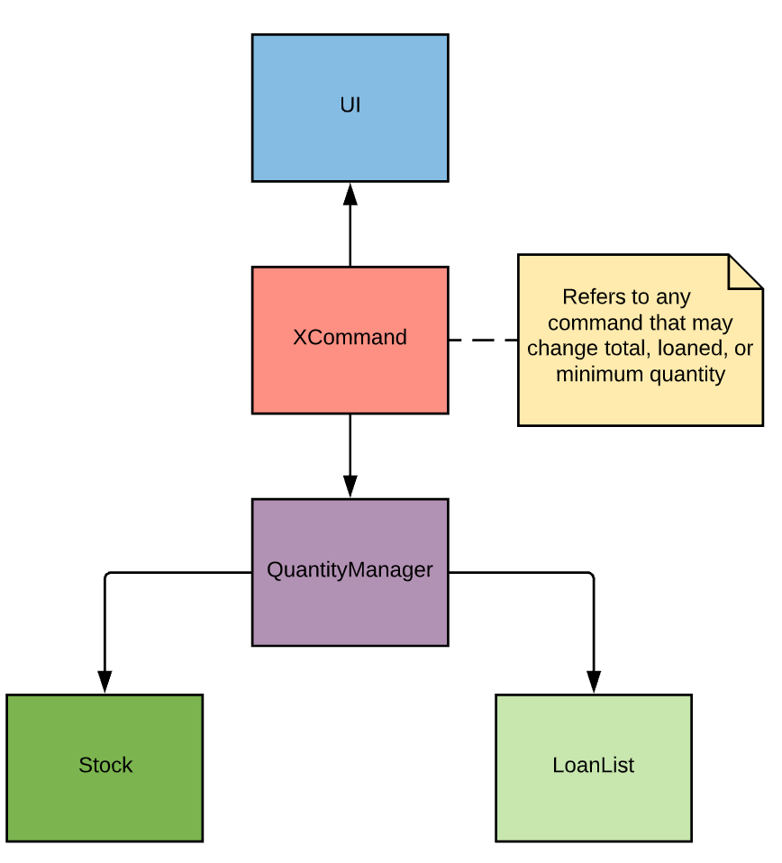
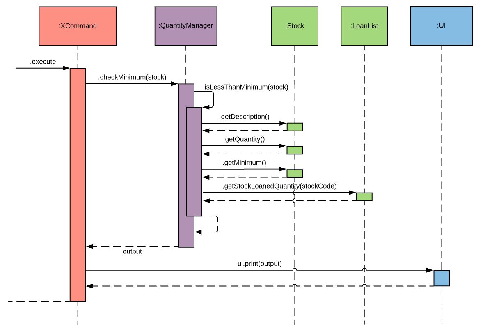

# Project Portfolio - Eggventory
### By: Oei Chiu Yan Rebecca

---
## About the Project

**Eggventory** is an inventory management system created by four other Computer Engineering students and me for our Year 2 Software Engineering module. During the first half of the module, we each created a simple task manager application. For the second half of the module, we were given 6 weeks to enhance one of the team members’ individual applications, or modify it into a different product. 

Our team chose to create Eggventory, an inventory management system specifically designed to be used by lab technicians in NUS Engineering labs. In particular, Eggventory is made specifically for use in schools, and allows users to track loans of equipment to students. 

I was the team leader for this project, and bore the responsibility of coordinating the team’s progress and deliverables for each milestone. In addition, my role as a developer was to implement the loan and minimum required quantity feature, which are documented below.

---
## Summary of contributions

This section summarises contributions I made to Eggventory. My individual feature is the of Minimum Required Quantity feature. This relied upon the development of the shared Loans feature, which I made significant contributions to. 

### **Individual Feature: Minimum required quantity**
**What it does**: Allows users to specify a minimum required quantity of a stock. This the minimum amount of the stock that the inventory intends to have on hand at any given time. Eggventory will warn users if the stock quantity has fallen below the minimum. Users can also generate a list detailing the amount of stocks they need to purchase to meet the respective minimum quantities. 

**Justification**: Before a stock is completely depleted, users would want receive some prior notice that it is running out. This gives them time to order new stocks or track down overdue loans. The minimum value to be user-defined, depending the importance or popularity of the stock within the inventory.   

**Highlights**: This feature was challenging to implement as any mistakes in processing integer quantities would result in major bugs (eg. negative stock). Careful consideration was given to the way this feature would require information from both the Stock and LoanList classes. 

### **Shared Feature: Loan System**
**What it does**: Allows users to record loans of the inventory's stock to other people, mainly students, and checks if there are sufficient stocks to make each loan. 

**Justification**: School inventories loan stock to students regularly, and benefit from a means of keeping track of all loans made. 

**Highlights**: Loans were implemented as an association between Person and Stock objects. This feature was developed in collaboration with team member [Benjamin](https://github.com/Deculsion).

### **Code Contributions**

**Loan Feature**: Primarily wrote the base code and worked on input validation linking Loans to Persons and Stocks. (Code: 
[Loan.java](https://github.com/AY1920S1-CS2113T-F09-3/main/blob/master/src/main/java/eggventory/model/loans/Loan.java),
[LoanList.java](https://github.com/AY1920S1-CS2113T-F09-3/main/blob/master/src/main/java/eggventory/model/LoanList.java),
[AddLoanCommand.java](https://github.com/AY1920S1-CS2113T-F09-3/main/blob/master/src/main/java/eggventory/logic/commands/add/AddLoanCommand.java).)

**Logic (Parser) Module**: Developed main Parser structure. Wrote logic for ParseAdd and ParseDelete. (Code: 
[Parser.java](https://github.com/AY1920S1-CS2113T-F09-3/main/blob/master/src/main/java/eggventory/logic/parsers/Parser.java), 
[ParseAdd.java](https://github.com/AY1920S1-CS2113T-F09-3/main/blob/master/src/main/java/eggventory/logic/parsers/ParseAdd.java),
[ParseDelete.java](https://github.com/AY1920S1-CS2113T-F09-3/main/blob/master/src/main/java/eggventory/logic/parsers/ParseDelete.java).)

**All code contributions**: [Reposense link.](https://nuscs2113-ay1920s1.github.io/dashboard/#search=cyanoei) _(Note: Contribution graph was affected by a rebase, but contributions are still properly attributed.)_

### **Other Contributions**

#### **Project management**
- Managed issues and PRs for each milestone (tagging and closing). 
- Tagged and wrote detailed comments for
[peer bug reports](https://github.com/AY1920S1-CS2113T-F09-3/main/issues?utf8=%E2%9C%93&q=is%3Aissue+label%3Atype.MockPE+)
after Mock PE. (eg.
[#297](https://github.com/AY1920S1-CS2113T-F09-3/main/issues/297)
[#328](https://github.com/AY1920S1-CS2113T-F09-3/main/issues/328)
[#334](https://github.com/AY1920S1-CS2113T-F09-3/main/issues/334)
)

#### **Documentation**
- Was responsible for final editing and submission of all drafts of User Guide and Developer guide. 
- Wrote User Guide sections 3.4, 3.5, and 3.7 (shown below).
- Wrote Developer Guide sections 5.3.1, 6.3, 6.5 (shown below). _(Note: Unable to link DG contributions as it is not on Github.)_

#### **Community**
- Over 60 [team PRs reviewed](https://github.com/AY1920S1-CS2113T-F09-3/main/pulls?utf8=%E2%9C%93&q=reviewed-by%3Acyanoei+), including:
[#220](https://github.com/AY1920S1-CS2113T-F09-3/main/pull/220),
[#223](https://github.com/AY1920S1-CS2113T-F09-3/main/pull/223),
[#251](https://github.com/AY1920S1-CS2113T-F09-3/main/pull/251),
[#261](https://github.com/AY1920S1-CS2113T-F09-3/main/pull/261),
[#345](https://github.com/AY1920S1-CS2113T-F09-3/main/pull/345),
[#349](https://github.com/AY1920S1-CS2113T-F09-3/main/pull/349),
[#366](https://github.com/AY1920S1-CS2113T-F09-3/main/pull/366).
- Bugs fixed for team code: 
[#236](https://github.com/AY1920S1-CS2113T-F09-3/main/pull/236),
[#240](https://github.com/AY1920S1-CS2113T-F09-3/main/pull/240),
[#352](https://github.com/AY1920S1-CS2113T-F09-3/main/pull/352),
[#358](https://github.com/AY1920S1-CS2113T-F09-3/main/pull/358).

- Meaningful bugs found in other teams' code: 
[[example1]](https://github.com/AY1920S1-CS2113T-F11-3/main/issues/146),
[[example2]](https://github.com/AY1920S1-CS2113T-F11-3/main/issues/147).

---
## Contributions to User Guide

This section shows my contributions made to the team’s User Guide. (The full User Guide can be found [here](https://github.com/AY1920S1-CS2113T-F09-3/main/blob/master/docs/CS2113T-F09-3-Eggventory-UG.md).)
I wrote sections
[3.4](https://github.com/AY1920S1-CS2113T-F09-3/main/blob/master/docs/CS2113T-F09-3-Eggventory-UG.md#34-managing-your-list-of-people) and
[3.5](https://github.com/AY1920S1-CS2113T-F09-3/main/blob/master/docs/CS2113T-F09-3-Eggventory-UG.md#35-managing-your-list-of-loans)
of the User Guide, which discuss Person entries and the use of the Loan feature respectively. 

Below is an extract of section [3.7](https://github.com/AY1920S1-CS2113T-F09-3/main/blob/master/docs/CS2113T-F09-3-Eggventory-UG.md#37-minimum-required-quantity), which explains the minimum required quantity feature. Please note that `markups` are used to indicate user commands. 

---
### 3.7 Minimum Required Quantity

The _minimum required quantity_ is the minimum amount of the stock that your lab intends to have on hand at all times. Loans can still be made until the stock fully runs out, but additional
  warnings will be displayed to remind you that stock is running low. 
  
In context, your lab may typically start restocking batteries when there are less than 30 batteries left. Thus, your minimum
   required quantity should be set to 30. 

#### 3.7.1 Setting Minimum Required Quantity
There are two ways to set a Stock's minimum required quantity. 

The first is to specify it when adding the stock, using the optional parameter `-m <minimum quantity>`. An additional confirmation message will acknowledge your use of the optional parameter. 

Format: `add stock <StockType> <Stock Code> <Quantity> <Description> -m <Minimum Quantity>`  
  
eg. `add stock Resistor R1k 1000 1Kohm resistor -m 500`

   

If you did not assign a minimum required quantity to the Stock when it was added, you can edit it at any time using the `edit` command. 
  
Format: `edit stock <StockCode> <Property> <New Value>`  
  
eg. `edit stock R500 minimum 100`  
  
#### 3.7.2 Receiving warnings about Quantity

Once you have set a _minimum required quantity_, checks are performed to compare the _available quantity_ (total quantity without loaned or lost stock) and _minimum required quantity_ at every instance where any values are updated. If your latest action, such as adding a Loan, causes the available quantity to fall below minimum, a warning will be printed as shown below. 

   

Realistically, you may not have sufficient quantity of a Stock at the moment you add it into the system. Thus, it is normal to receive minimum quantity warnings when adding a stock that currently has less than the minimum quantity, as shown below.

   
  
#### 3.7.3 Listing Stocks that are low in quantity: `list minimum`

This shows you a complete list of Stocks below their minimum required quantities. This list allows you quickly determine which Stocks are running out, and understand how much of this is due to excessive loaning or loss [coming in v2.0] of items. 

Format: `list minimum`

   

#### 3.7.3 Generating Shopping List: `list shopping`

This automatically generates a list of Stock and the quantity of each that you should consinder buying in order to attain the minimum required quantities. 

Format: `list shopping`

   
   
## Contributions to Developer Guide

This section shows my contributions made to the team’s Developer Guide. The full Developer Guide cannot be viewed online but can be downloaded [here](). I wrote sections 5.3.1 and 6.3, which describe the Parser Modules and LoanList implementation respectively. 

### 6.5 Minimum Required Quantity Feature
In a typical inventory, Stocks are regularly loaned out or even lost. Thus, users may want to decide upon a minimum quantity for each stock. This refers to the minimum amount of the stock that they intend to have on hand at any given time. 

With this need in mind, Eggventory gives users the ability to set and check the minimum required quantity of a Stock. This allows users to receive warnings when any changes cause the quantity of their available stock to become lower than the minimum quantity they have defined. 
  
#### 6.5.1 Quantity Manager

Quantity-related features in Eggventory are implemented with the QuantityManager class, which contains static methods for checking stocks for minimum quantity, and listing stocks if requested by the user. The Figure below details how QuantityManager interacts with the other classes in Eggventory. 

_Figure ?: Class diagram showing QuantityManager’s associations_

The QuantityManager is called by Commands to compare the available quantity (total quantity minus loans) with the minimum quantity each time one of these variables changes. The Command receives the result of this comparison and calls the UI to display extra warnings to the user. 

#### 6.5.2 Minimum Required Quantity

The minimum required quantity is implemented as the minimum attribute inside each stock class. This is an optional parameter, which users can choose to specify when adding new stocks. Otherwise, by default, the value of minimum is set to set to 0. The attribute can thereafter be updated using the edit command.

Checking of the minimum required quantity is required in four scenarios. 
When the user adds a new stock, specifying the minimum quantity. 
When the user edits the total quantity of a stock.
When the user edits the minimum required quantity of a stock. 
When the user adds loans of a stock. 

The figure below details the process of this checking. XCommand refers to any command that may result in any of the above scenarios. 

_Figure ?: Sequence diagram showing the minimum quantity check_

When any quantity-modifying Commands are made, the Quantity Manager is invoked by the Command to determine if the available quantity is now below minimum.  An additional message is printed to the CLI if the total available quantity is now lower than the minimum required quantity.
 
#### 6.5.2 List of Insufficient Stock
 
To enable users to quickly see which stocks need to be running low, the QuantityManager iterates through the StockList and constructs an ArrayList of a list of stocks which do not meet their minimum required quantity. This list can then be displayed to the user with a single list command, on both the CLI and GUI. 

#### 6.5.3 Shopping List

The QuantityManager creates the same list as described in 6.5.2. Then, an additional method calculates the required stock to purchase to meet the minimum required quantity. A new list is then created, listing the description of Stocks as well as the amount recommended for the user to purchase. 

#### 6.5.4 Design Considerations 

Determining how to implement the minimum quantity feature was challenging. Some of the options considered are discussed below. 

**Alternative 1**: Implement quantity management within the Stock class.  
- Pros: Easier to develop as most required variables are in the Stock class.
- Cons: Challenging to send print output to UI class (Stock is not aware of UI directly) 

**Alternative 2**: Implement quantity management within the LoanList class.
- Pros: Quantity management is primarily related to quantity decreases from loans
- Cons: Not open to future expansion - quantity may also be affected by lost Stock in the future

**Alternative 3 (Current choice)**: Implement an additional class to manage minimum quantity. 
- Pros: Decrease coupling - Stock and LoanList need not be aware of each other. Allows closer interaction with UI through the Command classes. Open to expansion. 
- Cons: Risk creating a God class if quantity management features are expanded in the future.

We prioritised the ability for the quantity feature to pass warning messages to the UI to be printed, in this case done through the Commands. This implementation also serves to increase separation of concerns, as neither Stock or LoanList need to be aware of whether quantity is sufficient. 
